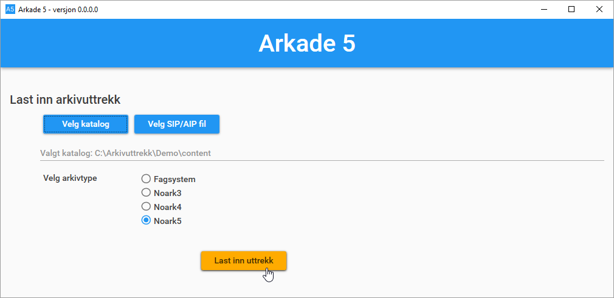
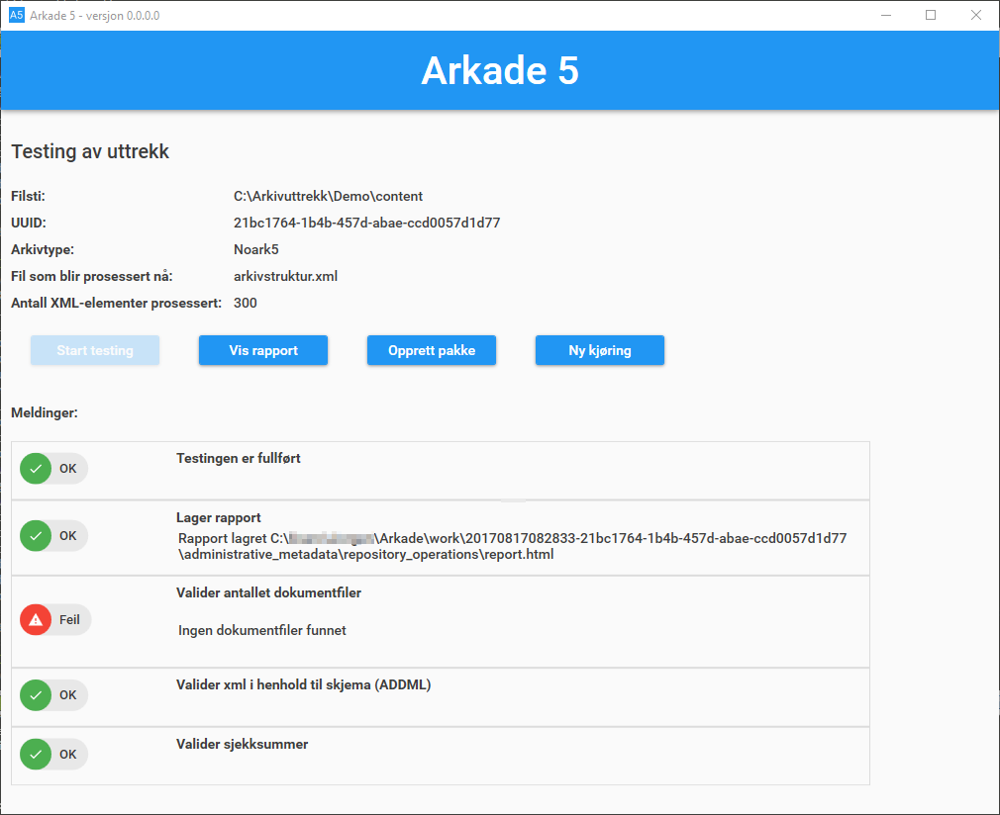
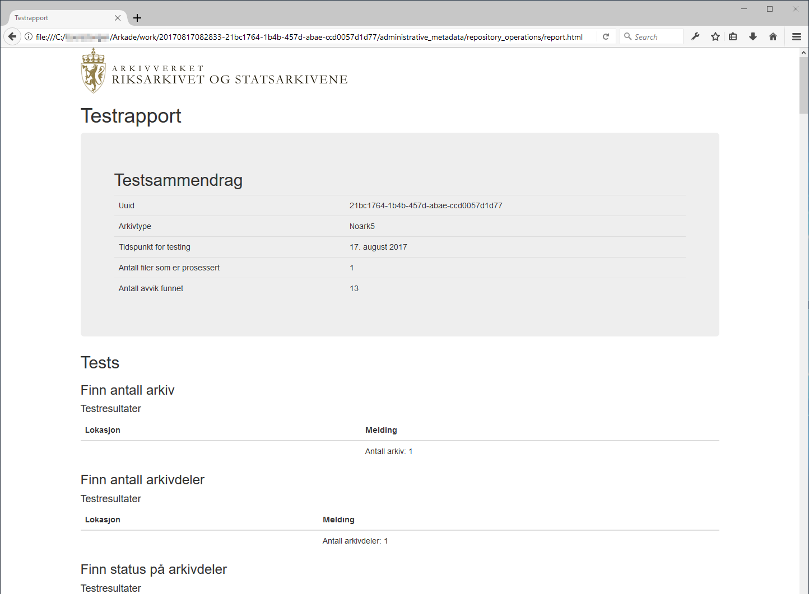
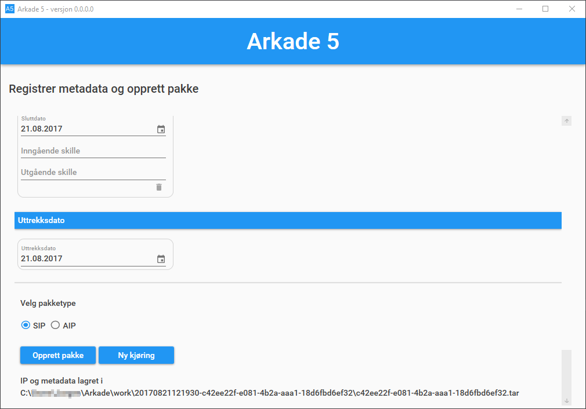
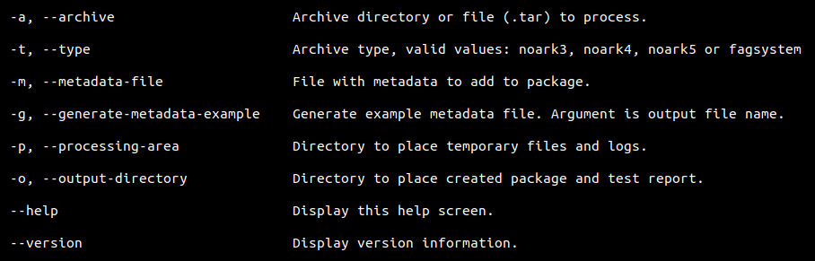
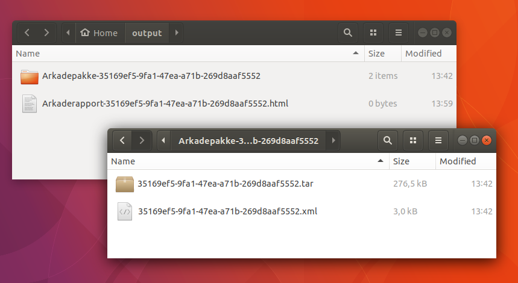

Brukerveiledning
================

Arkade 5
********

**Skrivebordsapplikasjon for Windows**

Arkade 5 brukes ved å lese inn et arkivuttrekk, utføre testing av uttrekket og/eller opprette en arkivpakke av uttrekket. Ved testing genereres det en utfyllende testrapport.
Arkade 5 muliggjør også opprettelse/endring av metadata for arkivuttrekk.

Oppstart/avslutning
~~~~~~~~~~~~~~~~~~~

Ved oppstart av Arkade åpnes innlastingsvinduet. Dersom et tilgjengelig område for midlertidige filer ikke allerede er definert, vil Arkade først be om at dette blir opppgitt (se innstillinger). Arkade avsluttes ved å lukke hovedvinduet. Ved avslutning igangsettes sletting av midlertidige filer.

Innlastingsvinduet
~~~~~~~~~~~~~~~~~~

Innlasting
----------

Velg og last inn arkivuttrekket som skal behandles:

1) Klikk på knappen "Velg katalog" dersom uttrekket er en ordinær fil-/mappestruktur. I tilfelle velges katalogen som inneholder arkivbeskrivelse-filen (addml.xml, arkivuttrekk.xml eller NOARKIH.xml). Klikk på knappen "Velg SIP/AIP-fil" dersom uttrekket er en AIP- eller SIP-struktur pakket som en tar-fil.

2) Oppgi arkivtype for det valgte uttrekket. Arkade 5 støtter typene "Fagsystem", "Noark 3" og "Noark 5".

3) Klikk på knappen "Last inn uttrekk". Det valgte uttrekket vil lastes inn og åpnes i testvinduet.

Testvinduet
~~~~~~~~~~~

Øverst i testvinduet vises:

* Full filsti for det valgte uttrekket
* En unik identifikator (UUID), generert for den gjeldende behandlingen av det valgte uttrekket
* Valgt arkivtype
* Hvilken fil som under testing prosesseres i øyeblikket
* Løpende informasjon om testkjøring*

*\*For uttrekk av typen Noark 5 vises antall prosesserte XML-elementer. For uttrekk basert på en ADDML-fil vises antall prosesserte filer og antall prosesserte poster.*

Testkjøring
-----------

Klikk på knappen "Start testing" for å starte testkjøring på det valgte uttrekket. Testkjøringen vil vare fra noen minutter til mange timer, avhengig av uttrekkets størrelse.

Under testkjøring vil det, i den nedre delen av vinduet, vises meldinger om innlesing, ev. strukturelle feil/mangler ved uttrekket, rapportgenerering og fullført testing.

Testrapport
-----------

Etter fullført testing vil en rapport i HTML-format bli generert. Klikk på knappen "Vis rapport" for å åpne den i en nettleser (den vil tilpasse seg gjeldende skjermflate). Ved opprettelse av arkivpakke inkluderes alltid testrapporten. Dersom den (i tillegg) skal tas vare på et annet sted, lagres den ved hjelp av nettleseren. Med rapporten åpen kan dette, i de fleste nettlesere, gjøres ved å taste Ctrl+s.

Arkivpakkegenerering
--------------------

Klikk på knappen "Opprett pakke" for å lage en arkivpakke (AIP/SIP) av uttrekket. Dette åpner arkivpakkevinduet der valg for pakken kan gjøres før den opprettes.

*Det er mulig å opprette en arkivpakke uten først å utføre testing av det aktuelle arkivuttrekket. En slik pakke vil ikke inneholde noen testrapport.*

Nytt uttrekk / ny kjøring
-------------------------

Ved klikk på knappen "Ny kjøring" avsluttes pågående arkivbehandling og Arkade returnerer til innlastingsvinduet. 
Dersom det inneværende arkivuttrekket endres, f.eks. som følge av feil/mangler vist i testrapporten, må uttrekket lastes inn på nytt (og ev. tester kjøres på nytt) før knappen "Opprett pakke" oppretter en pakke som inneholder endringene (og knappen "Vis rapport" åpner en gyldig testrapport). Uttrekket lastes inn på nytt ved å klikke "Ny kjøring" (eller ved å starte Arkade på nytt).

*NB! Skal det opprettes en arkivpakke som inkluderer resultatene fra inneværende testkjøring, må dette gjøres før "Ny kjøring" klikkes (eller Arkade avsluttes).*

Arkivpakkevinduet
~~~~~~~~~~~~~~~~~

Før arkivpakke opprettes registreres aktuelle metadata. For å skape en gyldig arkivpakke må påkrevde felter (merket *) utfylles. Dersom det aktuelle arkivuttrekket i utgangspunktet var en arkivpakke (AIP/SIP) med allerede definerte metadata, vil Arkade forsøke å lese disse inn og forhåndsutfylle feltene i arkivpakkevinduet. Ved å klikke knappen "Last inn eksisterende metadata" kan det velges en fil med forhåndsdefinerte metadata, enten en METS-fil (f.eks. {uuid}.xml, info.xml eller dias-mets.xml fra tidligere produsert pakke) eller metadata på JSON-format (f.eks. generert med Arkade CLI) for automatisk utfylling av feltene. Når pakken opprettes skrives den utfylte informasjonen til filen dias-mets.xml som legges ved i arkivpakken. Metadataene skrives også til filen {uuid}.xml som legges utenfor, på samme nivå som, arkivpakken.

I nedre del av vinduet velges ønsket pakketype, SIP eller AIP.

Når ønskede metadata er oppgitt, klikkes knappen "Opprett pakke". Dette åpner et dialogvindu for valg av pakkens plassering. Ved valgt plassering opprettes arkivpakken.

Arkivpakken vil opprettes som en tar-fil og filnavnet vil være UUID-en som er generert for den gjeldende arkivbehandlingen: *{uuid}.tar*. Pakken og tilhørende {uuid}.xml-fil plasseres i en katalog *Arkadepakke-{uuid}*. Når alt er ferdig generert, vises denne katalogen på den valgte plasseringen.

*TIPS: Så lenge arkivpakkevinduet ikke forlates, kan metadata endres og "Opprett pakke" klikkes på nytt. Velges samme pakkeplassering, overskrives foregående pakke og {uuid}.xml med oppdaterte metadata. Sørg bare for at filene som skal overskrives ikke er opptatt, f.eks. ved at de er åpnet i andre programmer.*

NB! Knappen "Ny kjøring" avslutter gjeldene arkivbehandling.

Innstillinger
~~~~~~~~~~~~~

Prosesseringsområde
-------------------

Under kjøring benytter Arkade et filområde til plassering av midlertidige filer fra arkivprosessering, system- og feillogger samt andre systemfiler. Plassering for prosesseringsområdet velges av bruker som en katalog i filsystemet og må være definert før arkiv kan behandles. Plasseringen som velges må være egnet med tanke på størrelse, tilgjengelighet og personvern. Størrelsen må være minst den av alle uttrekk som skal behandles under samme kjøring i tillegg til plass for systemfiler. Ved avslutning av Arkade igangsettes sletting av midlertidige filer og gamle loggfiler. Plasseringen av prosesseringsområdet kan når som helst endres fra innstillingsvinduet. Ved endring av plassering, igangsettes sletting av opprinnelig prosesseringsområde. Ny plassering vil tas i bruk neste gang Arkade startes.

__________________________________________________________________________

Arkade 5 CLI 
************

**Kommandolinjegrensesnitt for Linux, macOS og Windows**

Arkade 5 CLI tester og lager en arkivpakke av et arkivuttrekk med én kommando. Plasseringer for arkivutrekket som skal behandles, metadata, ferdig arkivpakke og testrapport samt midlertidige filer og systemlogger, oppgis alle som parametre til kommandoen.

`Se installasjonsveiledning for Arkade 5 CLI <Installasjonsveiledning.html#arkade-5-cli>`_

Kjøring
~~~~~~~

Arkade CLI kjøres med skriptet :code:`arkade.sh` som medfølger installasjonspakken.

(Arkade CLI som medfølger en installasjon av Arkade 5 for Windows, kjøres med :code:`Arkade.exe`)

For å kjøre skriptet slik som vist i eksemplene (:code:`./arkade.sh`), naviger til installasjonskatalogen:

.. code-block:: bash

	cd Arkade5CLI-<versjon>

*(Ved å tilgjengeliggjøre skriptet i PATH kan det kjøres med* :code:`arkade` *fra hvor som helst i filsystemet)*

Parametre
---------

Bruk :code:`--help` for å vise en oversikt over parametre:

.. code-block:: bash

	./arkade.sh --help

Alle parametre foruten :code:`--help` og :code:`--version` kan oppgis i kortform og må etterfølges av aktuell verdi f.eks. :code:`--type Noark5` eller :code:`-t Noark5`

Parametrenes rekkefølge er likegyldig.

*NB! Alle kataloger som oppgis som må eksistere på forhånd.*

Prosesseringsområde (CLI)
-------------------------

Under kjøring benytter Arkade et filområde til plassering av midlertidige filer fra arkivprosessering, system- og feillogger samt andre systemfiler. Plassering for prosesseringsområdet velges av bruker som en katalog i filsystemet og må oppgis med parameteret :code:`--processing-area` eller :code:`-p`. Plasseringen som velges må være egnet med tanke på størrelse, lese-/skrivehastighet og personvern. Størrelsen må være minst den av uttrekket som skal behandles, i tillegg til noen MB for systemfiler. Etter en arkivprosessering vil Arkade igangsette sletting av midlertidige filer og gamle loggfiler. Av tekniske hensyn fjernes ikke automatisk mindre enn 1 uke gamle loggfiler. Vær oppmerksom på at loggfiler kan inneholde personopplysninger. Det anbefales å bruke den samme plasseringen for prosesseringsområdet for hver kjøring. Slik kan Arkade automatisk fjerne loggfiler som er mer enn 1 uke gamle. Sørg ellers for manuelt å fjerne loggfilene.

Eksempel på bruk
----------------

Plasseringer og navn på kataloger for inn- og utdata er valgfrie. I eksemplene som følger brukes katalogene :code:`tmp/` og :code:`output/` i hjemmekatalogen :code:`~/`. Opprett de samme katalogene dersom du vil bruke eksempelkommandoene i denne veiledningen slik som de står.

.. code-block:: bash

	mkdir ~/tmp
	mkdir ~/output

Metadata
........

Ved arkivprosessering må det refereres til en fil med metadata på JSON-format eller METS-format. Arkade CLI kan generere en JSON-fil med eksempel-metadata som så kan redigeres.

Oppgi full filsti for metadatafilen som skal opprettes, med :code:`--generate-metadata-example` eller :code:`-g`. Det må også oppgis et prosesseringsområde med :code:`--processing-area` eller :code:`-p`.

I kommandoen under gis metadatafilen navnet :code:`metadata.json` og plassering i hjemmekatalogen :code:`~/`. Prosesseringsområdet er satt til katalogen :code:`~/tmp/`.

.. code-block:: bash

	./arkade.sh -g ~/metadata.json -p ~/tmp/

*Obligatoriske parametre ved metadatagenerering:* :code:`--generate-metadata-example`:code:`--processing-area`

Prosessering av arkivuttrekk
............................

*Arkivuttrekket som skal prosesseres kan foreligge som en ordinær mappestruktur eller en AIP/SIP-struktur pakket som en tar-fil. Parameterverdien for* :code:`--archive`/:code:`-a` *settes til hhv. katalogen som inneholder arkivbeskrivelse-filen (addml.xml, arkivuttrekk.xml eller NOARKIH.xml) eller til tar-filen.*

I eksempelkommandoen vist under leses det inn et arkivuttrekk fra katalogen :code:`~/N5-arkivuttrekk/`. Arkivuttrekkets type er oppgitt til :code:`noark5`. Metadata for uttrekket leses fra filen :code:`~/metadata.json/`. Katalog for plassering av prosesseringsområdet er satt til :code:`~/tmp/` og katalog for resulterende data er satt til :code:`~/output/`.

.. code-block:: bash

	./arkade.sh -a ~/N5-arkivuttrekk/ -t noark5 -m ~/metadata.json -p ~/tmp/ -o ~/output/

*Obligatoriske parametre ved arkivprosessering:*
:code:`--archive`:code:`--type`:code:`--metadata-file`:code:`--processing-area`:code:`--output-directory`

Resulterende data
.................

Kommandoen over produserer en arkivpakke (SIP) som en tar-fil, med tilhørende {uuid}.xml på METS-format, samlet i en katalog. Ved siden av katalogen plasseres en testrapport på HTML-format.

*For hver prosessering genereres en unik UUID som bl.a. brukes i fil- og katalognavn for resultatene.*

Alternativer
............

Dersom det ønskes kun testing eller kun pakking av et arkivuttrekk, kan den ene av delprosessene utelates med :code:`--skip` eller :code:`-s` etterfulgt av parameterverdien :code:`testing` eller :code:`packing`. Oppgis :code:`-s testing` produseres en utestet pakke, følgelig uten testrapport. Oppgis :code:`-s packing` utføres kun testing og kun en testrapport blir produsert.

Med :code:`--information-package-type` eller :code:`-i` etterfulgt av parameterverdien :code:`SIP` eller :code:`AIP` kan det velges om det skal produseres en pakke av typen SIP eller av typen AIP. Når dette parameteret ikke er oppgitt (som i eksempelet over) produseres en SIP som standard.