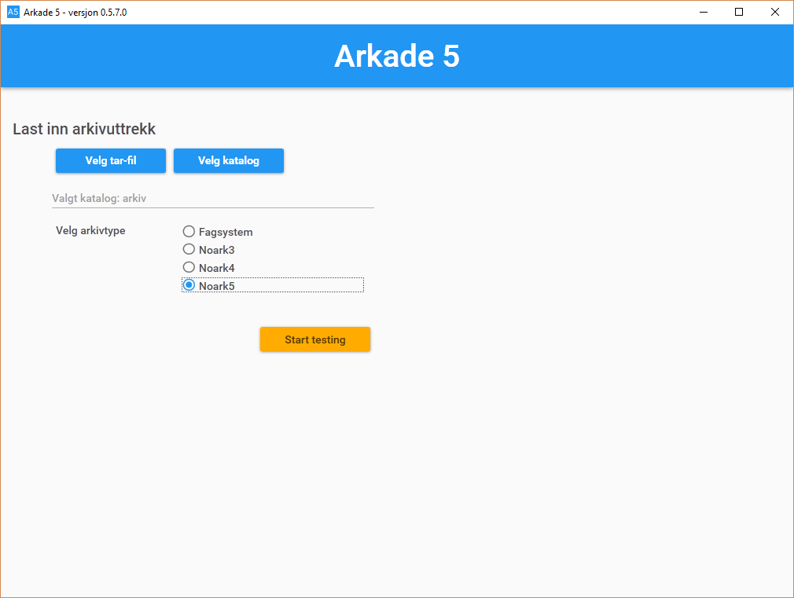
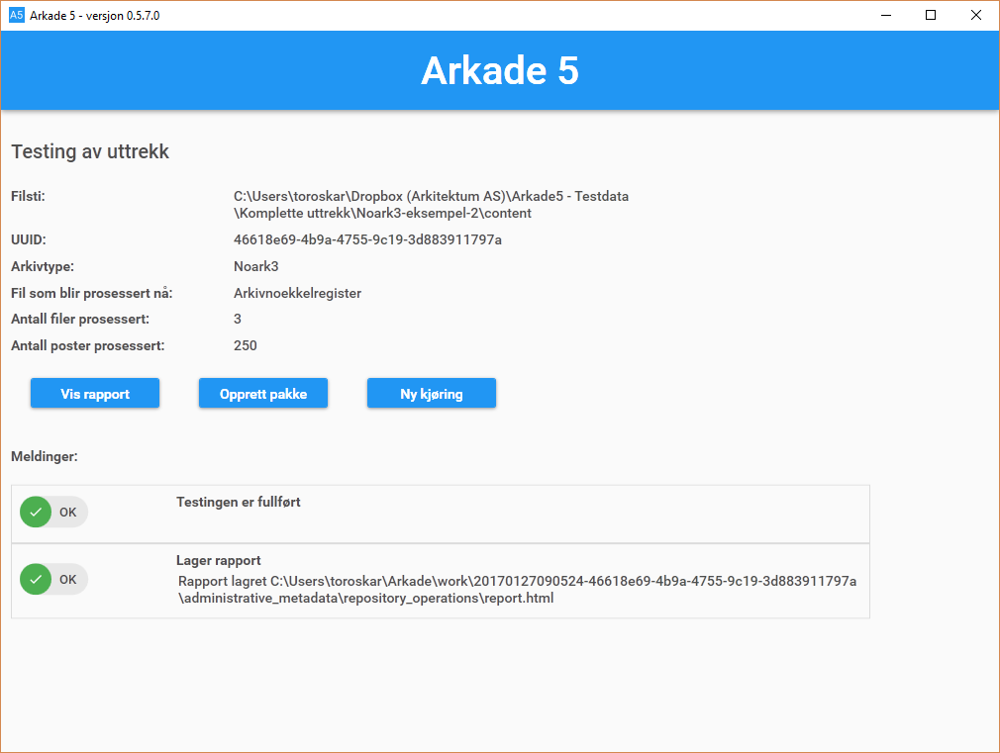
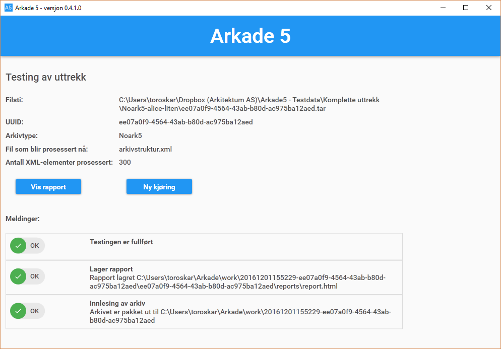
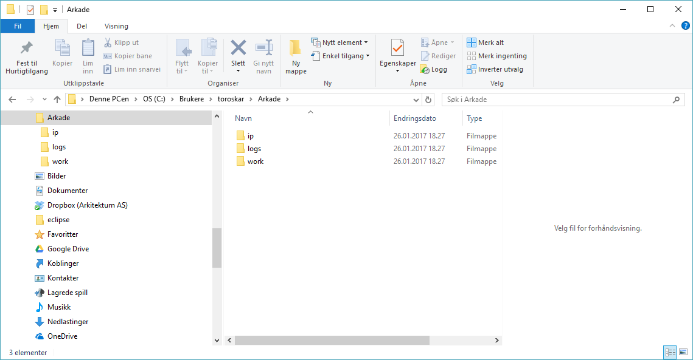
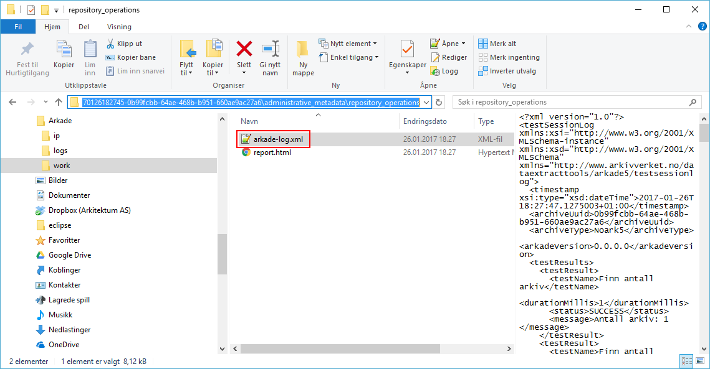

Brukerveiledning
================

Oppdatert 06.12.2016

Skjermen nedenfor vises ved oppstart av Arkade 5.
Versjonen støtter innlesing av arkivdata av format Norak3, Noark4, Noark5 og fagsystem.
Verktøyet kjører testere på arkivdataene.

Oppstartskjerm
~~~~~~~~~~~~~~~

Arkivet kan enten velges som en .tar fil eller rot mappen i en filstruktur (samme nivå som ADDML.XML filen). Valgene gjøres med henholdsvis "Velg tar-fil" eller "Velg katalog" knappen.
Videre må det velges hva slags type arkiv det er ved å velge radio knappen for Norak3, Noark4, Noark5 eller Fagsystem.
Når disse to valgene er gjort, kan "Start testing" knappen trykkes for å kjøre testene.

Test kjøring
~~~~~~~~~~~~~~~
Vinduet for test kjøringen viser litt foskjellige data etter som om det er et Noark5 uttrekk eller et utrekk basert på en ADDML fil.
Begge versjoner viser:

* Filsti (stien som ble valgt ved start av kjøringen)
* UUID for utrekk
* Løpened informasjon om test kjøringen

Det vises også meldinger om innlesing, rapportgenerering og fullført testing i den nedre delen av vinduet.

Test kjøring vindu for Norak3, Noark4 og Fagsystemer.

Test kjøring vindu for Norak5.

Rapport
~~~~~~~
En HTML rapport vil automatisk genereres ved fullført testing. Rapporten vil vises i en nettleser ved å klikke på 
knappen "Vis rapport". Et eksempel er vist nedenfor.

.. image:: img/TestReport.png

Fil informasjon
~~~~~~~~~~~~~~~
Ved innlesing av et arkiv, vil programmet opprette en arbeidsmappe for uttrekket.
Disse blir lagt i bruker filsystemet til brukeren som er innlogget på Windows PCen.

Filstien for arbeidsmappene er *C:\\Brukere\\{bruker}\\Arkade*.

Programlogger finnes i *C:\\Brukere\\{bruker}\\Arkade\\logs* mappen i dette området. Dette er en programm/utvilkler log som kan være nytting for Arkitektum ved feilsøking.

Datalogger som inneholder alle data from test kjøringen ligger som del av pakkestrukturen her:
*C:\\Brukere\\{bruker}\\Arkade\\work\\{dato og tid}-{uuid}\\administrative_metadata\\repository_operations\\arkade-log.xml*

