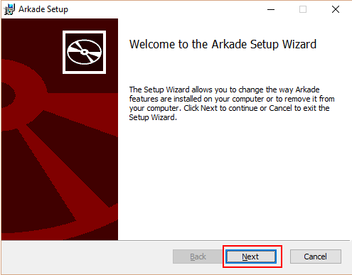
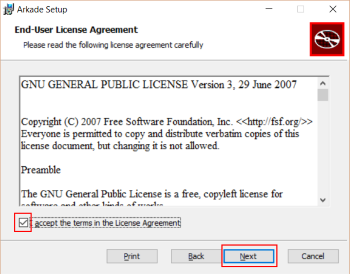
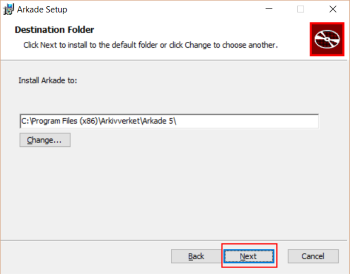
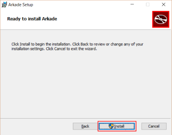
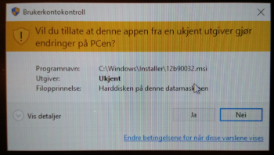
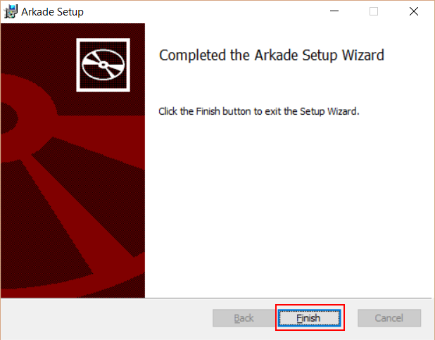
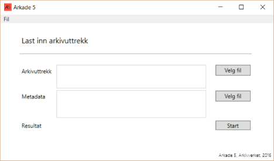

# Installering og avinstallering av Arkade 5 program
Nedlasting av installasjons filen er beskrevet i TODO.

## Start installasjonen fra .msi fil
Klikk på arkade5-setup-0.X.YY.msi for å starte installasjon av programmet.

## Installasjons veiviser
### Windows Smart Screen advarsel
Den følgende advarselen vil vises om Windows (Win10) maskinen har "Windows Smart Screen" satt på.
1  Klikk på "Mer info" 
2  Klikk "Kjør likevel"
*  Test punkt

(fremtidige versjoner av verktøyet kommer trolig ikke til å vise denne advarselen.)

### Installasjons vindu

*  Klikk "Next" på velkomst meny

*  Klikk "Accept the terms .." på End-User License Agreement vindu
*  Klikk "Next"

*  Klikk "Next" på "Destination Folder" vindu (bruk gitt installasjonsmappe)

*  Klikk "Install" for å starte installasjonen av programmet
*  Legg merket til at administrator rettigheter er nødvending

*  Klikk "Ja" på Brukerkontokontroll vindu

*  Klikk "Finish" for å avslutte installasjonen

## Kjør programmet

## Avinstallasjon av programmet

