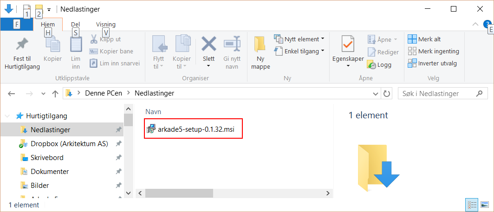
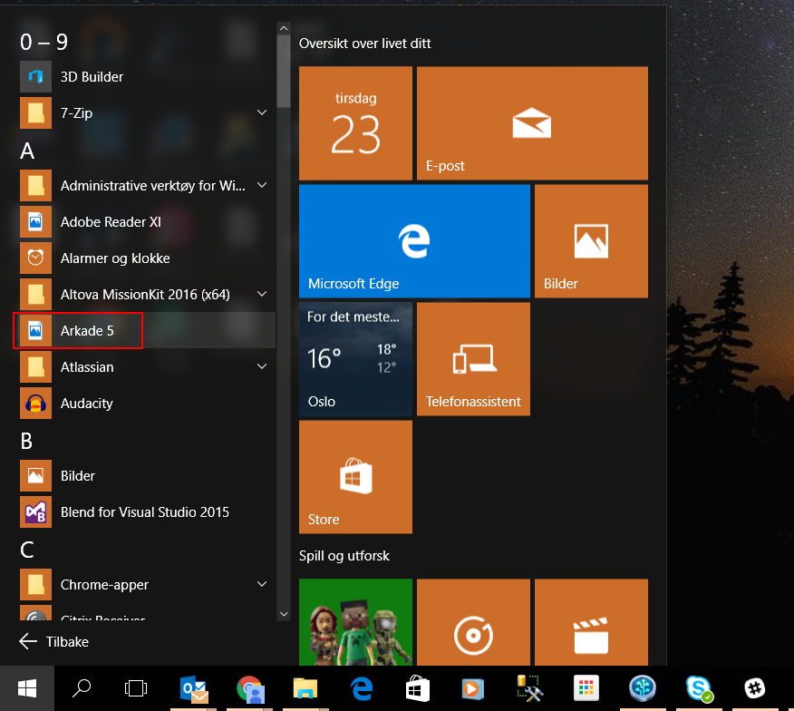
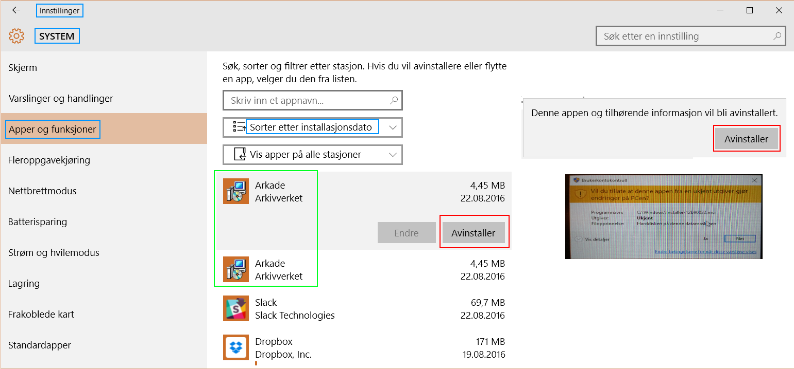

Installasjonsveiledning
=======================

Arkade 5
********

**Skrivebordsapplikasjon for Windows**

Installer .NET
~~~~~~~~~~~~~~

For å kjøre Arkade 5 må .NET Framework (minimum versjon 4.6.1) være installert.

|dotnet_framework_download_link|

.. |dotnet_framework_download_link| raw:: html

   <a href="https://dotnet.microsoft.com/download/dotnet-framework-runtime" target="_blank">Last ned siste versjon av .NET Framework</a>

Installer Arkade 5 
~~~~~~~~~~~~~~~~~~

`Last ned siste versjon av Arkade 5 <https://github.com/arkivverket/arkade5/releases/latest>`_ - Velg filen Arkade5-<versjon>.msi

Start installasjonen ved å dobbeltklikke den nedlastede msi-filen.

**Merk: Windows Smart Screen advarsel**
Den følgende advarselen vil vises om Windows-maskinen har "Windows Smart Screen" satt på (Windows 10).

.. image:: img/WinSmartScreenWarning.png

* Klikk på "Mer info"
* Klikk "Kjør likevel"

**Følg installasjonsveiviseren og aksepter alle de foreslåtte installasjonsvalgene.**

Kjør programmet
~~~~~~~~~~~~~~~

* Start -> Alle apper
* Finn "Arkade 5" i applikasjons-listen
* Klikk på "Arkade 5" for å kjøre programmet

Avinstallasjon av programmet (Windows 10)
~~~~~~~~~~~~~~~~~~~~~~~~~~~~~~~~~~~~~~~~~

* Klikk Start -> Instillinger -> System -> Apper og funksjoner
* Velg "Sorter etter installasjonsdato"
* Velg "Arkade" i listen over installerte programmer
* Klikk "Avinstaller"
* Klikk "Avinstaller" igjen i nytt vindu
* Klikk "Ja" på Brukerkontokontroll-advarselen fra Windows

__________________________________________________________________________

Arkade 5 CLI 
************

**Frittstående kommandolinjegrensesnitt for Linux, macOS og Windows**

*NB! Ved installasjon av Arkade 5 for Windows (beskrevet over) medfølger Arkade 5 CLI som filen Arkade.exe i installasjonskatalogen. På Windows behøver man ikke å følge anvisningene nedenfor med mindre man ønsker å innstallere Arkade 5 CLI som en frittstående applikasjon.*

Installer .NET Core
~~~~~~~~~~~~~~~~~~~

For å kjøre Arkade 5 CLI må .NET Core (minimum versjon 2.1) være installert.

|dotnet_core_download_link|

.. |dotnet_core_download_link| raw:: html

   <a href="https://dotnet.microsoft.com/download" target="_blank">Last ned siste versjon av .NET Core runtime</a>

Installer Arkade 5 CLI
~~~~~~~~~~~~~~~~~~~~~~

`Last ned siste versjon av Arkade 5 CLI <https://github.com/arkivverket/arkade5/releases/latest>`_ - Velg filen Arkade5CLI-<versjon>.zip

Pakk ut den nedlastede zip-filen til der Arkade ønskes kjørt fra.

*Det spiller ingen rolle hvor i filsystemet Arkade 5 CLI kjøres fra; plassering for alle inn- og ut-data velges som parametre ved kjøring.*

Gjør filen arkade.sh kjørbar:

.. code-block:: bash

	cd Arkade5CLI-<versjon>
	
	chmod +x arkade.sh

Ingen ytteligere installasjon er nødvendig.

Kjør Arkade 5 CLI
~~~~~~~~~~~~~~~~~

`Se brukerveiledning for Arkade 5 CLI <Brukerveiledning.html#arkade-5-cli>`_

Avinstaller Arkade 5 CLI
~~~~~~~~~~~~~~~~~~~~~~~~

* Slett katalogen Arkade5CLI-<versjon>
* Slett eventuelle gjenværende systemlogger

*Mindre enn 1 uke gamle system- og feillogger slettes ikke automatisk etter kjøring.* `Les mer ... <Brukerveiledning.html#prosesseringsomrade-cli>`_
