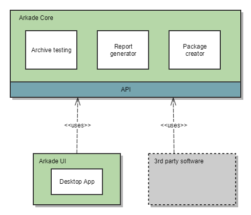
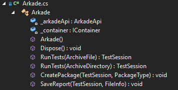

*******************
Systemdokumentasjon
*******************

Source code
===========

The source code is located at the GitHub-repository: https://github.com/arkivverket/arkade5/

Arkade is developed with .Net and C#. The solution-file (.sln) is compatible with Visual Studio 2015 and above. 

Overview
--------
Arkade provides mainly three different functions: 

* Archive testing
* Report generator
* Package creator

These functions are exposed in the API and the graphical user interface project is also using the API-class to interact with the core functions.

Below is a brief description of each project in the solution. 

Arkivverket.Arkade
------------------
This is the core library with functions for testing archive extractions, generating reports and creating SIP/AIP-packages.

The most notable classes in the core project are the test engines, package creator and report generator:

* Arkivverket.Arkade.Core.Noark5.Noark5TestEngine
* Arkivverket.Arkade.Core.Addml.AddmlDatasetTestEngine
* Arkivverket.Arkade.Core.InformationPackageCreator
* Arkivverket.Arkade.Report.HtmlReportGenerator

A short description of the packages in the core project:

**Core** - Domain classes

**ExternalModels** - Classes generated from xml schemas

**Identify** - Identification classes for reading and identifying an archive extraction

**Logging** - Classes related to logging of events during testing

**Metadata** - Contains classes related to creating metadata files for archive extractions

**Report** - Classes for generating test reports

**Resource** - Various resource files, language files, images etc.

**Tests** - Contains test classes for testing archive extractions

**Util** - General utilities

Arkivverket.Arkade.UI
---------------------

This project provides the graphical user interface of the Arkade 5 software. It is based on WPF, Windows Presentation Foundation. 
Together with WPF, the application uses the Prism_ library for creating a loosly coupled, maintainable and testable XAML application.  

Autofac_ is used as a dependency framework. Bootstrapping of the applications happens in **Bootstrapper.cs**. It is based on the bootstrapper provided by Prism and it loads the Autofac-module provided by the Arkade core library. 

The design and layout is based on Google's Material_ Design. This has been implemented with the help of the `MaterialDesignThemes-library <http://materialdesigninxaml.net/>`_. Note that the user interface is only inspired by the material design, not neccessary strictly following it in every situation. 

.. _Prism: https://github.com/PrismLibrary/Prism
.. _Autofac: https://autofac.org
.. _Material: https://material.google.com/

Arkivverket.Arkade.Test
-----------------------
This project contains the unit tests and other tests classes for the project. Unit tests are created with xUnit. 

Setup
-----
This is the setup project for creating installation binaries. You need the `Wix-toolset <http://wixtoolset.org/>`_ to be able to use the Setup-project. 

Signing the installation file
^^^^^^^^^^^^^^^^^^^^^^^^^^^^^

In order to sign the msi file, you need the **signtool.exe** on your computer. This can be installed together with the Visual Studio. The ClickOnce Publishing package contains this tools.

Signing of the installation file is done by the continuous integration server. Signing is performed with a certificate provided by Arkivverket. The following command is run to sign the installation file::

    "C:\Program Files (x86)\Windows Kits\8.1\bin\x64\signtool.exe" sign /f PATH_TO_CERTIFICATE_FILE.pfx /p CERTIFICATE_PASSWORD src\Setup\bin\Release\Setup.msi

Sample.ConsoleApp
------------------------------
This is a sample application, which demonstrates the use of the Arkade API.

Porting to other platforms
--------------------------
For now the application is only developed for use on the Microsoft Windows platform. However, with the new `.Net Core project <https://www.microsoft.com/net/core/platform>`_ from Microsoft, a cross platform application should be possible when the framework and tools has matured. The .Net Core platform allows running .net applications on linux and mac in addition to windows. 

The Arkade project has few external dependencies and it should be possible to either update them to newer versions when they are compatible with .net core or replace them with other compatible libraries. Currently there are only three external libraries in use: 

* `SharpZipLib <https://icsharpcode.github.io/SharpZipLib/>`_
* Autofac_
* `Serilog <https://serilog.net/>`_

In addition there are some of the .net packages that has been restructured, deprecated or removed that need to be fixed before the application is fully cross platform compatible.

The graphical user interface can be a challenge to port, currently Microsoft has no plans for porting the Windows Presentation Framework to other platforms. This means that for creating a linux desktop app, you might have to recreate the user interface with another graphics library. Preferably a library that works on both linux and mac.

Some useful links regarding porting to .net core: 
* https://blogs.msdn.microsoft.com/dotnet/2016/02/10/porting-to-net-core/
* https://marketplace.visualstudio.com/items?itemName=ConnieYau.NETPortabilityAnalyzer

Arkade API
==========

The Arkade project provides API-classes for simplified use of the core functionality. There are two API-classes included: Arkade.cs and ArkadeApi.cs. They are located inside the namespace **Arkivverket.Arkade.Core**. Both classes provides the same functionality, the difference is that Autofac_ is used for dependency injection in the Arkade class. The ArkadeApi class must be instantiated manually. There is an Autofac module that can be used, **Arkivverket.Arkade.Util.ArkadeAutofacModule**, if the client software already is using Autofac for dependency injection. 

This is the signature of the Arkade API class:

There are two **RunTests** methods that runs for a given archive, either from a directory structure or a SIP/AIP package file (.tar). After the tests are run, the api returns a **TestSession**. The **TestSession** class contains all necessary information for creating a package with tests results or generating a report. 

A simple test run may look like this:

.. code-block:: C

   
   var arkade = new Arkade();
   var testSession = arkade.RunTests(ArchiveFile.Read("c:\\tmp\\ExampleArchive.tar", ArchiveType.Noark5));
   arkade.SaveReport(testSession, new FileInfo("c:\\tmp\TestReport.html"));
   arkade.CreatePackage(testSession, PackageType.SubmissionInformationPackage);

The **TestSession** class contains various information about the testing that has been done. The TestSuite property contains a list of all tests that has been run and their results. 

See the sample project (Sample.ConsoleApp) in the source code, for a complete example that runs testing on a Noark5 archive.

ADDML
=====

Arkade is built to support ADDML version 8.2. 

List of supported ADDML processes:

* A.01 Analyse_CountRecords - Antall poster
* A.02 Analyse_CountChars - Antall tegn
* A.03 Analyse_FindExtremeRecords - Lengste og kortest post
* A.04 Analyse_CountRecordDefinitionOccurences - Antall poster for posttype
* A.05 Analyse_AllFrequenceList - Koder brukt i datasettet
* A.06 Analyse_CrossTable
* A.07 Analyse_CountNULL - Antall null-verdi for felt
* A.08 Analyse_FindExtremeValues - Lengste og korteste verdi for felt
* A.09 Analyse_FindMinMaxValue - Laveste og høyeste verdi for felt
* A.10 Analyse_FrequenceList - Antall forekomster av verdier for felt
* A.11 Control_AllFixedLength - Kontroll av oppgitt lengde for alle posttyper
* A.12 Control_NumberOfRecords - Antall og kontroll av antall poster
* A.13 Control_FixedLength - Kontroll av oppgitt lengde for posttype
* A.14 Control_NotUsedRecordDef - Kontroll om posttype benyttes
* A.15 Control_Key - Kontroll av unik nøkkel
* A.16 Control_ForeignKey - Kontroll av fremmednøkkel
* A.17 Control_MinLength - Kontroll av oppgitt minste lengde
* A.18 Control_MaxLength - Kontroll av oppgitt største lengde
* A.19 Control_DataFormat - Kontroll av oppgitt dataformat for felt
* A.20 Control_NotNull - Kontroll av null-verdier i felt
* A.21 Control_Uniqueness - Kontroll av unike verdier i felt
* A.22 Control_Codes - Koder som benyttes i felt
* A.32 Control_Birthno - Kontroll av fødselsnummer i felt
* A.33 Control_Organisationno - Kontroll av organisasjonsnummer i felt
* A.34 Control_Accountno - Kontroll av kontonummer i felt
* A.35 Control_Date_Value - Kontroll av dato i felt
* A.36 Control_Boolean_Value - Kontroll av boolsk verdi i felt

NOARK 5
=======

Arkade supports the NOARK5 standard.

List of implemented Noark5 Tests:

* N5.02 - Kontroll av sjekk-summene for filene arkivuttrekk.xml og addml.xsd
* N5.03 - Kontroll av sjekk-summene for XML-filene og XML-skjemaene i avleveringspakken
* N5.04 - Antall arkiver i arkivstrukturen
* N5.05 - Antall arkivdeler i arkivstrukturen
* N5.06 - Arkivdelen[e]s status i arkivstrukturen
* N5.07 - Antall klassifikasjonssystemer i arkivstrukturen
* N5.08 - Antall klasser i arkivstrukturen
* N5.09 - Antall klasser uten underklasser eller mapper i det primære klassifikasjonssystemet i arkivstrukturen
* N5.10 - Antall mapper i arkivstrukturen
* N5.11 - Antall mapper for hvert år i arkivstrukturen
* N5.12 - Kontroll på at mappene bare er knyttet til klasser uten underklasser i arkivstrukturen
* N5.13 - Antall mapper som er klassifisert med hver enkelt klasse i arkivstrukturen
* N5.14 - Antall mapper uten undermapper eller registreringer i arkivstrukturen
* N5.15 - Saksmappenes status i arkivstrukturen
* N5.16 - Antall registreringer i arkivstrukturen
* N5.17 - Antall forskjellige journalposttyper i arkivstrukturen
* N5.18 - Antall registreringer for hvert år i arkivstrukturen
* N5.19 - Kontroll på at registreringer bare er knyttet til klasser uten underklasser i arkivstrukturen
* N5.20 - Antall registreringer som er klassifisert med hver enkelt klasse i arkivstrukturen
* N5.21 - Antall registreringer uten dokumentbeskrivelse i arkivstrukturen
* N5.22 - Journalpostenes status i arkivstrukturen
* N5.23 - Antall dokumentbeskrivelser i arkivstrukturen
* N5.24 - Antall dokumentbeskrivelser uten dokumentobjekt i arkivstrukturen
* N5.25 - Dokumentbeskrivelsenes status i arkivstrukturen
* N5.26 - Antall dokumentobjekter i arkivstrukturen
* N5.27 - Start- og sluttdato for dokumentene i arkivstrukturen
* N5.28 - Antall dokumentfiler i arkivuttrekket
* N5.29 - Antall dokumenter i arkivuttrekket fordelt på dokumentformat
* N5.30 - Kontroll av sjekk-summen for hver dokumentfil i arkivuttrekket
* N5.32 - Kontroll på om dokumentobjektene i arkivstrukturen refererer til eksisterende
* N5.33 - Kontroll på at det ikke finnes dokumentfiler i arkivuttrekket som mangler referanse fra dokumentobjektet 
* N5.34 - Antall dokumentfiler som blir referert til av flere enn ett dokumentobjekt
* N5.35 - Antall saksparter i arkivstrukturen
* N5.36 - Antall merknader i arkivstrukturen
* N5.37 - Antall kryssreferanser i arkivstrukturen
* N5.38 - Antall presedenser i arkivstrukturen
* N5.39 - Antall korrespondanseparter i arkivstrukturen
* N5.40 - Antall avskrivninger i arkivstrukturen
* N5.41 - Antall dokumentflyter i arkivstrukturen
* N5.42 - Eventuelt - antall skjerminger i arkivstrukturen
* N5.43 - Eventuelt - antall graderinger i arkivstrukturen
* N5.44 - Eventuelt - antall kassasjonsvedtak i arkivstrukturen
* N5.45 - Eventuelt - antall utførte kassasjoner i arkivstrukturen
* N5.46 - Eventuelt - antall konverterte dokumenter i arkivstrukturen
* N5.47 - Kontroll av system-identifikasjonene i arkivstrukturen
* N5.48 - Kontroll av referansene til arkivdel i arkivstrukturen
* N5.51 - Kontroll av referansene til sekundær klassifikasjon i arkivstrukturen
* N5.59 - Antall journalposter i arkivuttrekket
* N5.60 - Start- og sluttdato i arkivuttrekket
* N5.61 - Antall endringer i endringsloggen
* N5.62 - Kontroll av referansene i endringsloggen
