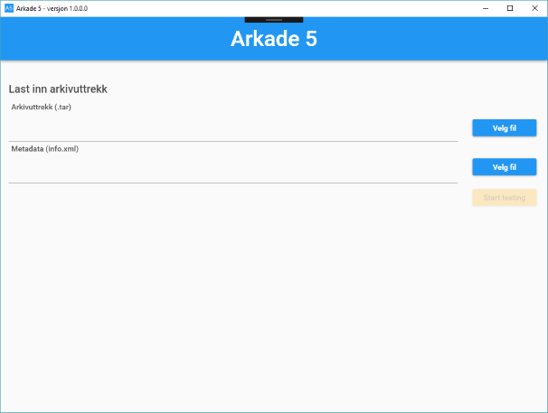
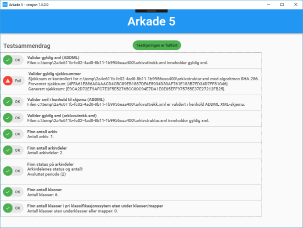

# Brukerveiledning

## Versjon 1.0.0.0
Skjermen nedenfor vises ved oppstart av Arkade5.  
Versjonen støtter innlesing av Noark5 arkivdata, og kjører tester på arkivet.  
Testdekkingen er ennå ikke 100% for Noark5.

### Oppstart skjerm 

Noark5 arkivets tar fil og info.xml filers velges med de to "velg fil" knappene.  
Testene kjøres ved å trykke "Start testing".

### Test status

Testsammendrag skjermen holder brukere oppdater på framdriften av tester og   
testresultatet av de some er ferdig kjørt.   
Beskjeden "Testkjøringen er fullført" vil bli vist når testen er ferdig.  

### Annen infomasjon
Verktøyet bruker C:/temp som arbeidfolder.   
En testlogg fil er lagret i <TODO>

