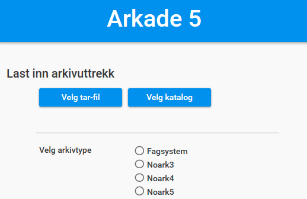
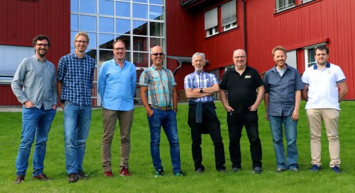

.. Arkade5 documentation master file, created by
   sphinx-quickstart on Thu Dec  1 09:48:38 2016.
   You can adapt this file completely to your liking, but it should at least
   contain the root `toctree` directive.

Arkade 5 - testverktøy for arkivuttrekk
=======================================

* |Installer Arkade 5|_

.. |Installer Arkade 5| replace:: **Installer Arkade 5**
.. _Installer Arkade 5: Installasjonsveiledning.html

Pressemelding
~~~~~~~~~~~~~

4. september 2017 lanserte `Arkivverket <https://www.arkivverket.no>`_ versjon 1.0 av et nytt testverktøy - "Arkade 5".

Arkade vil etter hvert erstatte alle de testverktøy som Arkivverket har for å teste kvalitet av datasett generert fra arkivsystemer. Et viktig poeng er at Arkade kan teste så å si **alle** aktuelle varianter av arkivuttrekk, Noark standarder 3, 4 og 5 - pluss såkalte fagsystemer. 

Arkade tester arkivuttrekk, produserer testrapporter og "pakker inn" data basert på gjeldende arkivstandarder for metadata. Testing av data baserer seg primært på Arkivverkets standard `ADDML <https://www.arkivverket.no/forvaltning-og-utvikling/regelverk-og-standarder/andre-arkivstandarder/addml-archival-data-description-markup-language>`_ for beskrivelse av datastrukturer. 

Arkade er en frittstående applikasjon som fritt kan lastes ned og enkelt installeres av alle. Programmet er svært enkelt i bruk. I prosjektfasen er det hentet innspill, kommentarer og idéer fra både kommunal og statlig sektor. Ved å senke terskelen for bruk av testverktøy håper vi å forenkle prosessene både hos arkivskapere og arkivinstitusjoner. Blant annet vil feil og avvik kunne oppdages mye tidligere, noe som sparer både tid og kostnader for alle involverte.
All kildekode og funksjonalitet i Arkade er lagt ut som åpen kildekode, så det vil også være mulig for eksterne å lage spesialtilpasninger.

Arkivverket vektlegger dessuten forvaltning og videreutvikling av programvaren. Det er allerede en løpende prosess for å legge inn mer funksjonalitet basert på registrerte ønsker under utvikling av versjon 1.0. Det vil også etableres brukerforum og tekniske støttefunksjoner, der man tidligere kanskje ikke har vært gode nok utad.
Utvikling av Arkade 5 har krevd ett år med utvikling og testing. Prosjektet har vært styrt av Arkivverket, mens programvaren har vært utviklet eksternt av firmaet `Arkitektum AS <http://arkitektum.no>`_. Samarbeidet med Arkitektum fortsetter, men forvaltning videre vil være Arkivverkets ansvar.

*"Arkade vil utgjøre en enorm tidsbesparelse ved testing av uttrekk, både for arkivskaper og depot."*
Solveig Heløe Olsen, Rådgiver, Interkommunalt Arkiv, Troms.

*Team Arkade, fra Arkitektum AS (A) og Arkivverket (AV): 
Fra venstre: Jørgen Tellnes (A), Henning Jensen (A), Joachim Fugleberg (AV), Hallstein Søvik (A), Erik Aaberg (AV), Terje Pettersen Dahl (AV), Tor Oskar Ova Johnsen (A), Jørgen Østengen Vik-Strandli (AV).*

*Foto: Benjamin Dehli (A)*

Innhold
~~~~~~~

.. toctree::
   :maxdepth: 2

   Installasjonsveiledning
   Brukerveiledning
   Systemdokumentasjon
   Versjonshistorikk
